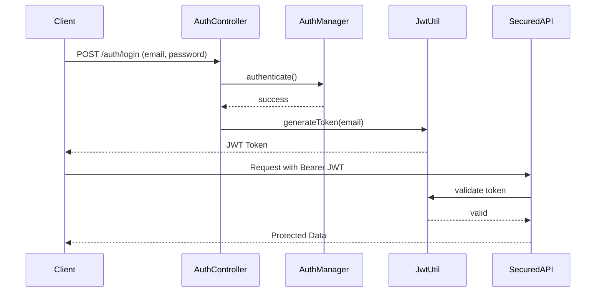

# 🔐 JWT Authentication with Spring Boot

This project implements **JWT (JSON Web Token) authentication** in a Spring Boot application using **email and password login**. It demonstrates a **stateless authentication mechanism** with Spring Security and JWT, suitable for REST APIs.

---

## 📌 Features

* ✅ Email & Password based login
* ✅ JWT generation and validation
* ✅ Stateless authentication (no sessions)
* ✅ Secured APIs using Bearer Token
* ✅ Custom JWT filter
* ✅ Password encryption using BCrypt
* ❌ No roles/authorities (simple authentication only)

---

## 🧩 Authentication Flow



---

## 🏗️ Project Structure

```
src/main/java/com/ritanath/jwtauthentication
│
├── controller
│   └── AuthController.java
│   └── AppUserController.java
│
│
├── service
│   └── AppUserService.java
│
├── utils
│   ├── JwtUtil.java
│   └── SecurityConfig.java
│
├── model
│   └── AppUser.java
```

---

## 🔑 Authentication APIs

### ▶️ Login API

**POST** `/auth/login`

**Request Body**

```json
{
  "email": "user@test.com",
  "password": "password123"
}
```

**Response**

```json
{
    "issuedAt": "2026-01-07T15:10:54.937497Z",
    "tokenType": "Bearer",
    "email": "user@test.com",
    "token": "ey----------.ey-----------.8-----------"
}
```

---

## 🔐 Using JWT Token (Postman)

### Access Secured API

**GET** `/user`

**Headers**

```
Authorization: Bearer <JWT_TOKEN>
```

✔ If token is valid → 200 OK
❌ If token is invalid/expired → 401 Unauthorized

---

## 🛡️ Security Configuration Highlights

* CSRF disabled
* Stateless session management
* Custom JWT filter before `UsernamePasswordAuthenticationFilter`
* `/auth/**` endpoints are public
* All other endpoints require JWT

---

## 🔒 Password Security

* Passwords are stored using **BCrypt hashing**
* Password comparison uses `PasswordEncoder.matches()`


---

## 🚀 Run the Application

### Prerequisites

* Java 17+
* Maven

### Steps

```bash
git clone https://github.com/ritanath2k03/JWTAuthentication.git
cd jwtauthentication
./mvnw spring-boot:run
```

Server runs on:

```
http://localhost:8080
```

## 👨‍💻 Author

**Ritanath Malakar**
GitHub: [https://github.com/ritanath2k03](https://github.com/ritanath2k03)

---

⭐ If you find this project helpful, hit a star!
